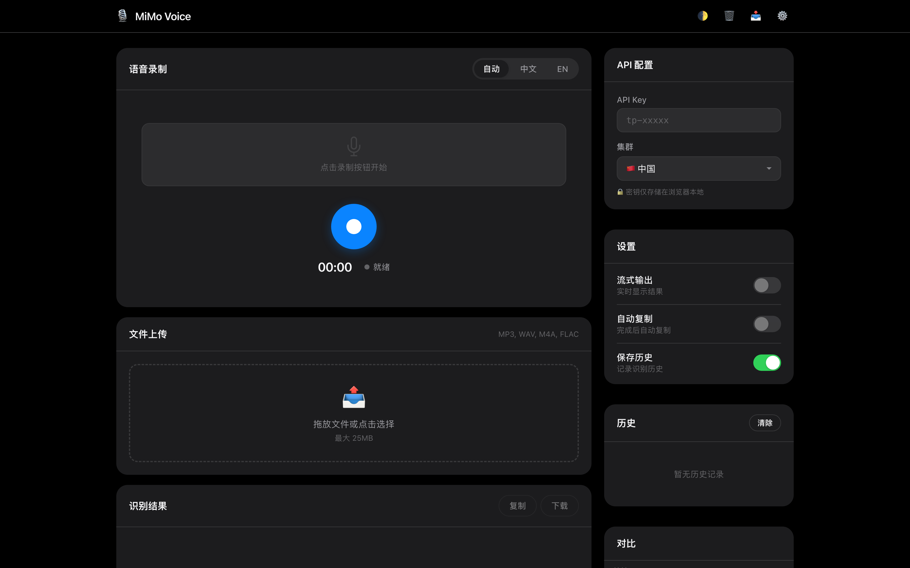

# 🎙️ MiMo Voice

基于小米 MiMo-V2.5-ASR 的语音识别 Web 应用。

<p align="center">
  
</p>

## 功能

- 🎤 实时录音 + 波形可视化
- 📁 文件上传（MP3/WAV/M4A/FLAC → 自动转 WAV）
- 🌐 多语言：自动 / 中文 / 英文
- 📜 历史记录 + 导出
- 🌙 深色模式

## 快速开始

```bash
git clone https://github.com/Kennems/mimo-voice.git
cd mimo-voice
npm install

# 配置
cp .env.example .env
# 编辑 .env 填入你的 Token Plan API Key

npm start
```

打开 http://localhost:3000

## 配置

```env
PORT=3000
MIMO_API_KEY=tp-xxxxx
MIMO_CLUSTER=cn    # cn / sgp / ams
```

## License

MIT
